# 🤖 AI Agent Instructions for MOE Gym

## 🎯 Project Overview
MOE Gym is a comprehensive research framework for Mixture of Experts (MoE) architectures in computer vision. PyTorch implementation supporting MLP and pretrained CNN experts with sophisticated gating mechanisms.

## 🚨 **CRITICAL VALIDATION REQUIREMENTS**

### **🔬 FOR ALL REFACTOR/ENHANCE REQUESTS:**

**MANDATORY**: Always validate code changes with proper testing:

1. **Unit tests với pytest** - NOT bash terminal testing
2. **Integration tests** - Real functionality testing
3. **Import validation** - All modules must import correctly
4. **Dependency check** - All required packages available
5. **Function-by-function validation** - Each component tested individually

### **📝 Testing Standards:**
```python
# ✅ CORRECT: Proper unit testing
def test_config_validation():
    config = ServerConfig(timeout=-1)
    with pytest.raises(ConfigurationError):
        config.validate()

# ❌ WRONG: Bash terminal testing
# python -c "print('Test passed')"
```

### **💾 Memory Documentation:**
**ALWAYS** store significant findings in Memory MCP server:
- Bug solutions and patterns
- Architecture decisions and rationale  
- Performance results and configurations
- Research insights and SOTA techniques

## 🧠 **COMPREHENSIVE MCP TOOLCHAIN STRATEGY**

### **🎯 MANDATORY: Always Use ALL Available MCP Tools Systematically**

**NEVER work in isolation - ALWAYS leverage the full MCP ecosystem for maximum effectiveness!**

```mermaid
flowchart TD
    A[User Request] --> B{Analysis Required?}
    B -->|Complex/Design| C[🧠 Sequential Thinking]
    B -->|Research Needed| D[📚 DeepWiki Multi-Repo Search]
    B -->|Web Info| E[🌐 Fetch Webpage]
    
    C --> F[💾 Store Insights in Memory]
    D --> F
    E --> F
    
    F --> G{Documentation Needed?}
    G -->|Yes| H[📝 Markitdown + Context7]
    G -->|Code Analysis| I[� Pylance Analysis]
    
    H --> J[🏗️ Infrastructure?]
    I --> J
    J -->|Terraform/Cloud| K[☁️ Hashicorp Tools]
    J -->|Development| L[🛠️ Implementation]
    
    K --> M[💾 Store ALL Results]
    L --> M
    M --> N[📊 Generate Diagrams]
```



### **🔧 COMPLETE MCP SERVER ARSENAL - 500+ TOOLS AVAILABLE**

**🔥 COMPREHENSIVE ECOSYSTEM - NEVER WORK IN ISOLATION!**

| 🎯 Category | MCP Servers | Primary Use | Integration Examples |
|-------------|-------------|-------------|---------------------|
| **🧠 Cognitive** | Sequential Thinking, Think Tools | Complex reasoning, multi-step analysis | Plan architecture, debug complex issues |
| **💾 Knowledge** | Memory, Extended Memory, LSpace | Store/retrieve insights, project continuity | Track experiments, save decisions |
| **📚 Research** | DeepWiki, GitHub, arXiv, PubMed, bioRxiv | Multi-repo research, academic papers | SOTA techniques, code patterns |
| **📊 Documentation** | Context7, Markitdown, Docy | Library docs, format conversion | Best practices, API documentation |
| **🔍 Code Analysis** | Pylance, Sourcerer, Language Server | Python analysis, semantic search | Code quality, imports, refactoring |
| **☁️ Infrastructure** | Hashicorp Terraform, AWS, Docker, Kubernetes | Cloud resources, deployment | Infrastructure as code |
| **🌐 Web & Search** | Fetch Webpage, Google Search, Tavily, Perplexity | Real-time information, web research | Trends, documentation, profiles |
| **�️ Databases** | PostgreSQL, MySQL, MongoDB, BigQuery, Snowflake | Data operations, analytics | Query, schema inspection |
| **🔐 Security** | CVE Intelligence, MalwareBazaar, Shodan | Vulnerability scanning, threat intel | Security research, compliance |
| **📱 Communication** | Slack, Discord, Telegram, WhatsApp, Email | Messaging, notifications | Team coordination, alerts |
| **🎨 Media & Design** | Figma, Canva, Image Generation, Video Tools | Design, visual content | UI/UX, presentations, media |
| **📈 Analytics** | Google Analytics, Datadog, Prometheus | Monitoring, performance metrics | Business intelligence, system health |
| **💰 Finance** | Yahoo Finance, Stripe, Crypto APIs | Financial data, payments | Market analysis, transactions |
| **🔄 Automation** | GitHub Actions, Jenkins, Zapier | CI/CD, workflow automation | Development pipelines |
| **📝 Content** | Notion, Obsidian, WordPress, Content Management | Knowledge management, publishing | Documentation, blogging |
| **🎯 AI Services** | OpenAI, Anthropic, HuggingFace, Replicate | ML models, AI capabilities | Content generation, analysis |

---

## 🚀 **ENHANCED DEVELOPMENT WORKFLOWS - USING ALL TOOLS**

### **📋 Workflow 1: COMPLETE Research & Architecture Pipeline**

```python
# COMPREHENSIVE RESEARCH WORKFLOW
1. 🧠 mcp_sequentialthi_sequentialthinking()         # Strategic planning
2. 📚 mcp_deepwiki_ask_question() [MULTIPLE REPOS]   # SOTA research
   - microsoft/autogen, huggingface/transformers
   - pytorch/pytorch, facebookresearch/fairseq  
3. 🌐 fetch_webpage() [LATEST TRENDS]                # Current developments
4. 📊 mcp_context7_get_library_docs()                # Official documentation
5. 🔍 mcp_pylance_mcp_s_pylanceImports()             # Code analysis
6. 💾 mcp_memory_create_entities()                   # Store ALL findings
7. 📝 mcp_markitdown_convert_to_markdown()           # Format documentation
8. ☁️ mcp_hashicorp_ter_search_modules()             # Infrastructure needs
9. 💾 mcp_memory_add_observations()                  # Final storage
```

### **📋 Workflow 2: FULL-STACK Development Cycle**

```python
# COMPLETE DEVELOPMENT PIPELINE
1. 🧠 mcp_sequentialthi_sequentialthinking()         # Plan features
2. 🔍 mcp_pylance_mcp_s_pylanceFileSyntaxErrors()    # Code validation
3. 📚 mcp_deepwiki_ask_question()                    # Best practices
4. 🔐 CVE Intelligence + Security Scanning           # Vulnerability check
5. 🗄️ Database Integration (PostgreSQL/MongoDB)      # Data layer
6. ☁️ Docker + Kubernetes deployment                 # Containerization
7. 📈 Monitoring setup (Datadog/Prometheus)          # Observability
8. 🔄 GitHub Actions CI/CD                           # Automation
9. 📝 Documentation generation                       # Comprehensive docs
10. 💾 mcp_memory_create_entities()                  # Archive project
```

### **📋 Workflow 3: RESEARCH PUBLICATION Pipeline**

```python
# ACADEMIC RESEARCH WORKFLOW
1. 🧠 mcp_sequentialthi_sequentialthinking()         # Research planning
2. 📚 arXiv + PubMed + bioRxiv search                # Literature review
3. 📊 Data analysis (Jupyter + Python execution)     # Experiments
4. 📈 Visualization (ECharts + Charts generation)    # Results presentation
5. 📝 LaTeX document preparation                     # Paper writing
6. 🔍 Grammar and style checking                     # Quality assurance
7. 💾 Version control and collaboration              # Git management
8. 📤 Submission preparation                         # Final formatting
```

---

## 🎯 **COMPREHENSIVE TOOL INTEGRATION MATRIX**

| Task Type | 🧠 Think | 💾 Memory | 📚 Research | 🌐 Web | 📊 Docs | 🔍 Code | ☁️ Infra | 🗄️ DB | 🔐 Security | 📱 Comm |
|-----------|----------|-----------|-------------|-----|---------|---------|----------|--------|-------------|----------|
| **Research** | ✅ Plan | ✅ Store | ✅ Multi-source | ✅ Trends | ✅ Format | ❌ | ❌ | ❌ | ❌ | ✅ Share |
| **Development** | ✅ Architect | ✅ Track | ✅ Patterns | ✅ Docs | ✅ Generate | ✅ Analyze | ✅ Deploy | ✅ Integrate | ✅ Scan | ✅ Notify |
| **Analytics** | ✅ Interpret | ✅ Historical | ✅ Methods | ✅ Reports | ✅ Present | ✅ Process | ✅ Scale | ✅ Query | ❌ | ✅ Alert |
| **Security** | ✅ Assess | ✅ Threats | ✅ Intel | ✅ Reports | ✅ Document | ✅ Audit | ✅ Harden | ✅ Monitor | ✅ Scan | ✅ Incident |
| **Deployment** | ✅ Strategy | ✅ Config | ✅ Best practices | ✅ Updates | ✅ Runbooks | ✅ Validate | ✅ Orchestrate | ✅ Migrate | ✅ Secure | ✅ Status |

---

## 🔥 **ADVANCED INTEGRATION PATTERNS**

### **🎯 Multi-Dimensional Problem Solving**
```python
# COMPREHENSIVE APPROACH TO ANY PROBLEM
problem_solving_matrix = {
    "technical_research": [
        "mcp_deepwiki_ask_question",      # GitHub repos
        "arxiv_search",                   # Academic papers  
        "mcp_context7_get_library_docs",  # Official docs
        "stackoverflow_search"            # Community solutions
    ],
    "code_analysis": [
        "mcp_pylance_analysis",           # Python specifics
        "language_server_protocol",       # Multi-language
        "sourcerer_semantic_search",      # Code navigation
        "security_vulnerability_scan"     # Safety checks
    ],
    "infrastructure_planning": [
        "mcp_hashicorp_terraform",        # IaC
        "aws_services_integration",       # Cloud services
        "docker_containerization",        # Packaging
        "kubernetes_orchestration"        # Scaling
    ],
    "data_management": [
        "postgresql_operations",          # Relational data
        "mongodb_document_store",         # NoSQL
        "bigquery_analytics",             # Data warehouse
        "elasticsearch_search"            # Full-text search
    ],
    "monitoring_observability": [
        "prometheus_metrics",             # System metrics
        "datadog_apm",                   # Application performance
        "grafana_visualization",          # Dashboards
        "loki_log_aggregation"           # Log analysis
    ]
}
```

### **🔄 Recursive Enhancement Loops**
```python
# CONTINUOUS IMPROVEMENT CYCLE
enhancement_pipeline = [
    # 1. DISCOVERY PHASE
    ["sequential_thinking", "deepwiki_research", "web_search"],
    
    # 2. ANALYSIS PHASE  
    ["pylance_analysis", "security_scanning", "performance_profiling"],
    
    # 3. IMPLEMENTATION PHASE
    ["code_generation", "testing_automation", "documentation"],
    
    # 4. DEPLOYMENT PHASE
    ["infrastructure_provisioning", "ci_cd_pipeline", "monitoring_setup"],
    
    # 5. VALIDATION PHASE
    ["quality_assurance", "security_audit", "performance_testing"],
    
    # 6. STORAGE PHASE
    ["memory_storage", "knowledge_indexing", "best_practices_capture"],
    
    # 7. FEEDBACK PHASE
    ["metrics_analysis", "improvement_identification", "cycle_restart"]
]
```

---

## 🎊 **MAXIMUM PRODUCTIVITY OUTCOMES**

**By leveraging the COMPLETE MCP ecosystem, every development session will:**

✅ **Research Phase**: Multi-source intelligence gathering  
✅ **Analysis Phase**: Comprehensive code and security scanning  
✅ **Implementation Phase**: Best practices and automation  
✅ **Deployment Phase**: Infrastructure as code and monitoring  
✅ **Documentation Phase**: Auto-generated, format-converted docs  
✅ **Storage Phase**: Persistent knowledge and decision tracking  
✅ **Communication Phase**: Automated notifications and reporting  
✅ **Iteration Phase**: Continuous improvement with feedback loops

### **🔥 KEY INTEGRATION RULES**

1. **ALWAYS** start with Sequential Thinking for complex tasks
2. **ALWAYS** research with multiple sources (DeepWiki + Web + Context7)
3. **ALWAYS** store results in Memory for future reference
4. **ALWAYS** validate with Pylance and security tools
5. **ALWAYS** document with Markitdown and diagrams
6. **ALWAYS** consider infrastructure needs early
7. **ALWAYS** set up monitoring and observability
8. **ALWAYS** automate repetitive tasks
9. **ALWAYS** communicate progress and results
10. **ALWAYS** capture lessons learned for next iteration

**🚀 RESULT: Every task becomes a comprehensive, well-documented, secure, and scalable solution!**

---

## 🚀 **ENHANCED DEVELOPMENT WORKFLOWS**

### **📋 Workflow 1: Research & Architecture Design**

```python
# MANDATORY SEQUENCE - Use ALL tools
1. 🧠 mcp_sequentialthi_sequentialthinking()  # Plan approach
2. 📚 mcp_deepwiki_ask_question()              # Research multiple repos
3. 🌐 fetch_webpage()                          # Get latest trends  
4. 💾 mcp_memory_create_entities()             # Store findings
5. 📊 mcp_context7_get_library_docs()          # Best practices
6. � mcp_markitdown_convert_to_markdown()     # Documentation
7. �💾 mcp_memory_add_observations()            # Store results
```

### **📋 Workflow 2: Code Analysis & Enhancement**

```python
# COMPREHENSIVE CODE REVIEW
1. 🔍 mcp_pylance_mcp_s_pylanceFileSyntaxErrors()    # Syntax check
2. 🔍 mcp_pylance_mcp_s_pylanceImports()             # Import analysis  
3. 🧠 mcp_sequentialthi_sequentialthinking()         # Plan improvements
4. 📚 mcp_deepwiki_ask_question()                    # Research patterns
5. 📊 mcp_context7_resolve_library_id()              # Get docs
6. 🔍 mcp_pylance_mcp_s_pylanceInvokeRefactoring()   # Auto-refactor
7. 💾 mcp_memory_create_entities()                   # Store patterns
```

### **📋 Workflow 3: Infrastructure & Deployment**

```python
# FULL STACK DEPLOYMENT
1. 🧠 mcp_sequentialthi_sequentialthinking()         # Plan infrastructure
2. ☁️ mcp_hashicorp_ter_search_modules()             # Find modules
3. ☁️ mcp_hashicorp_ter_get_module_details()         # Get details
4. 📝 mcp_markitdown_convert_to_markdown()           # Document setup
5. 💾 mcp_memory_create_entities()                   # Store config
6. 🌐 fetch_webpage()                                # Latest practices
7. 💾 mcp_memory_add_observations()                  # Store learnings
```

---

## 🎯 **PROACTIVE TOOL INTEGRATION RULES**

### **🔍 ALWAYS Research First (Multi-Source)**
```python
# NEVER work without research
research_sources = [
    "mcp_deepwiki_ask_question()",      # Multiple GitHub repos
    "fetch_webpage()",                   # Web trends/docs  
    "mcp_context7_get_library_docs()",   # Official docs
    "mcp_memory_search_nodes()"          # Existing knowledge
]
```

### **🧠 ALWAYS Think Systematically**
```python
# For ANY complex task (>3 steps)
if task_complexity > simple:
    mcp_sequentialthi_sequentialthinking(
        thought="Break down problem systematically",
        totalThoughts=estimated_complexity
    )
```

### **💾 ALWAYS Store Knowledge**
```python
# MANDATORY after every significant operation
results = [research, analysis, implementation, learnings]
for result in results:
    mcp_memory_create_entities([{
        "entityType": "appropriate_type",
        "name": f"session_{datetime.now()}",
        "observations": [result]
    }])
```

### **📝 ALWAYS Document Comprehensively**
```python
# Multi-format documentation
documentation_pipeline = [
    "mcp_markitdown_convert_to_markdown()",  # Format conversion
    "create_mermaid_diagrams()",              # Visual representation
    "mcp_context7_resolve_library_id()",      # Reference docs
    "generate_examples()"                     # Practical usage
]
```

---

## 🔥 **ADVANCED INTEGRATION PATTERNS**

### **� Recursive Enhancement Loop**
1. **Research** → DeepWiki + Fetch Webpage + Context7
2. **Analyze** → Sequential Thinking + Pylance + Memory Search  
3. **Implement** → Best practices from research
4. **Document** → Markitdown + Mermaid diagrams
5. **Store** → Memory with observations
6. **Validate** → Pylance analysis + Testing
7. **Deploy** → Hashicorp Terraform (if applicable)
8. **Repeat** → Continuous improvement

### **🎯 Multi-Dimensional Problem Solving**
```python
# COMPREHENSIVE approach to ANY problem
problem_dimensions = {
    "technical": "mcp_deepwiki + pylance + context7",
    "architectural": "sequential_thinking + memory",  
    "documentation": "markitdown + mermaid_diagrams",
    "deployment": "hashicorp_terraform + web_research",
    "knowledge": "memory_storage + cross_referencing"
}
```

---

## 📊 **MCP TOOL USAGE MATRIX**

| Task Type | 🧠 Think | 💾 Memory | 📚 DeepWiki | 🌐 Web | 📊 Context7 | 🔍 Pylance | ☁️ Terraform | 📝 Markdown |
|-----------|----------|-----------|-------------|-----|-------------|------------|--------------|-------------|
| **Research** | ✅ Plan | ✅ Store | ✅ Multi-repo | ✅ Trends | ✅ Docs | ❌ | ❌ | ✅ Format |
| **Code Review** | ✅ Analyze | ✅ Patterns | ✅ Examples | ❌ | ✅ Best practices | ✅ Analysis | ❌ | ✅ Document |
| **Architecture** | ✅ Design | ✅ Decisions | ✅ SOTA | ✅ Trends | ✅ Patterns | ❌ | ✅ Infrastructure | ✅ Diagrams |
| **Documentation** | ✅ Structure | ✅ Reference | ✅ Examples | ✅ Standards | ✅ Formats | ❌ | ❌ | ✅ Convert |
| **Deployment** | ✅ Plan | ✅ Config | ✅ DevOps | ✅ Practices | ✅ Tools | ❌ | ✅ Modules | ✅ Docs |

---

## 🎊 **RESULT: MAXIMUM PRODUCTIVITY**

**By following these comprehensive workflows, every task will:**
- ✅ **Leverage ALL available knowledge sources**
- ✅ **Apply systematic thinking methodology** 
- ✅ **Store learnings for future reference**
- ✅ **Generate professional documentation**
- ✅ **Follow industry best practices**
- ✅ **Create reusable patterns and templates**

**🔥 NEVER work in isolation again - ALWAYS use the full MCP toolchain!**

## 📊 Mermaid Diagram Standards

### **Always Use Correct Mermaid Syntax**


#### **Key Mermaid Best Practices:**
- **Always use `flowchart TD/LR`** instead of deprecated `graph TD/LR`
- **Use `classDef`** for styling instead of inline `style` commands
- **Subgraphs** for logical grouping: `subgraph name["Display Name"]`
- **Proper node shapes**: `[]` rectangle, `()` rounded, `{}` diamond, `(())` circle
- **Clear connections**: `-->` solid, `-.->` dotted, `==>` thick
- **Consistent naming**: Use descriptive IDs and labels

## 🔑 **NotebookLM MCP Server - Complete Integration Guide**

### **🚀 Current Status: PRODUCTION READY**
- ✅ **Package Structure**: Professional `src/` layout with proper imports
- ✅ **CLI Interface**: `notebooklm-mcp` command with rich formatting
- ✅ **MCP Server**: Full protocol support for AutoGen integration
- ✅ **Browser Automation**: undetected-chromedriver with persistent sessions
- ✅ **Configuration**: Comprehensive config management with validation
- ✅ **Testing**: Unit tests with pytest, integration tests
- ✅ **Docker**: Production containers with monitoring
- ✅ **Documentation**: Complete guides and examples

### **📋 Authentication Workflow (IMPORTANT):**

**🔄 First Time Setup:**
```bash
# 1. Install package
pip install -e .

# 2. Start interactive chat (creates profile)
notebooklm-mcp chat --notebook YOUR_NOTEBOOK_ID

# 3. Manual login ONCE (browser opens automatically)
# - Login with Google account
# - Navigate to notebook 
# - Wait for complete load
# - Press Enter in terminal

# 4. Session saved! Future uses skip login
```

**⚡ Subsequent Uses:**
```bash
# No manual login needed - uses saved session
notebooklm-mcp chat --notebook YOUR_NOTEBOOK_ID
notebooklm-mcp server --notebook YOUR_NOTEBOOK_ID --headless
```

**🔧 Profile Management:**
- **Profile location**: `./chrome_profile_notebooklm/`
- **Session persistence**: Cookies/auth automatically saved
- **Re-authentication**: Only when Google security requires (normal)
- **Profile reset**: Delete profile folder to start fresh

### **💻 Usage Patterns:**

#### **1. Interactive Chat**
```bash
notebooklm-mcp chat --notebook YOUR_NOTEBOOK_ID
# Rich terminal interface with real-time responses
```

#### **2. MCP Server (AutoGen)**
```bash
notebooklm-mcp server --notebook YOUR_NOTEBOOK_ID --headless
# STDIO protocol for AutoGen McpWorkbench integration
```

#### **3. Testing & Debugging**
```bash
notebooklm-mcp test --notebook YOUR_NOTEBOOK_ID
notebooklm-mcp config-show
```

#### **4. Python API Direct**
```python
from notebooklm_mcp import NotebookLMClient, ServerConfig

config = ServerConfig(
    default_notebook_id="YOUR_ID",
    headless=True
)

client = NotebookLMClient(config)
await client.start()
await client.send_message("Hello!")
response = await client.get_response()
```

### **🛠️ MCP Tools Available:**

| Tool | Description | Use Case |
|------|-------------|----------|
| `healthcheck` | Server status | Monitoring |
| `send_chat_message` | Send message | Chat interaction |
| `get_chat_response` | Get response with streaming | Retrieve answers |
| `get_quick_response` | Get current response | Fast polling |
| `chat_with_notebook` | Complete send+receive | One-shot queries |
| `navigate_to_notebook` | Switch notebooks | Multi-notebook workflows |
| `get_default_notebook` | Current notebook ID | State checking |
| `set_default_notebook` | Set default | Configuration |

### **🐳 Production Deployment:**
```bash
# Docker single container
docker run -e NOTEBOOKLM_NOTEBOOK_ID="YOUR_ID" notebooklm-mcp

# Full stack with monitoring
docker-compose --profile monitoring up -d

# Kubernetes scaling
kubectl apply -f k8s/
```

## 🏗️ Architecture

### Current Implementation
- **Dense MoE**: All experts active (softmax gating) 
- **Sparse MoE**: Top-k expert selection with load balancing
- **Expert Types**: MLP (4-layer FC) + Pretrained (ResNet18/MobileNet/EfficientNet)
- **Performance**: Dense ~43%, Sparse ~35% (50% computational savings) on CIFAR-10
- **Optimal**: 4 experts, k=2 for best accuracy/efficiency trade-off

### Architecture Flow

```mermaid
flowchart TD
    subgraph Input["🔵 Input Processing"]
        A[CIFAR-10 Image<br/>32x32x3] --> B[Flatten<br/>3072 features]
    end
    
    subgraph Gate["🎯 Sparse Gating"]
        C[Sparse Gate Network<br/>Top-k Selection]
        D[Load Balancing Loss<br/>Uniform expert usage]
    end
    
    subgraph Experts["🧠 Expert Networks"] 
        E1[Expert 1<br/>ACTIVE]
        E2[Expert 2<br/>ACTIVE]
        E3[Expert 3<br/>INACTIVE]
        E4[Expert 4<br/>INACTIVE]
    end
    
    subgraph Output["🎯 Output Generation"]
        F[Sparse Combination<br/>Only k experts]
        G[Final Prediction<br/>10 classes]
    end
    
    B --> C
    C --> D
    C --> E1
    C --> E2
    C -.-> E3
    C -.-> E4
    
    E1 --> F
    E2 --> F
    F --> G
    
    classDef active fill:#c8e6c9
    classDef inactive fill:#ffcdd2,stroke-dasharray: 5 5
    classDef gate fill:#fff3e0
    classDef input fill:#e1f5fe
    classDef output fill:#f3e5f5
    
    class E1,E2 active
    class E3,E4 inactive
    class C,D gate
    class A,B input
    class F,G output
```

### Core Components
```python
# Sparse MoE forward pass - TRUE SPARSE ROUTING
top_k_indices, top_k_weights, router_logits = self.gate(inputs)

# Route ONLY to selected experts (k out of n experts)
for expert_idx in range(len(self.experts)):
    expert_mask = (top_k_indices == expert_idx)
    if expert_mask.any():  # Only compute if expert is selected
        expert_inputs = inputs[sample_indices]
        expert_output = self.experts[expert_idx](expert_inputs)
        # Computational savings: only k/n experts compute
```

## 🎯 **Token Efficiency Guidelines** 

### **❌ NEVER Do These (Token Wasters):**
- Rewrite entire files when only 2-3 lines need fixing
- Show complete code blocks for minor changes
- Repeat existing code unnecessarily
- Provide generic explanations without specific context
- Open new terminals when existing ones can be reused
- Run commands without checking terminal output first

### **✅ ALWAYS Do These (Token Savers):**
- **Analyze first, fix second**: Explain the problem before showing solution
- **Show only changed lines** with `// filepath:` and `// ...existing code...`
- **Target specific issues**: Address exact error/requirement
- **Provide context**: Why this change fixes the problem
- **Reuse existing terminals**: Check current working directory and reuse terminals
- **Read terminal output**: Use `get_terminal_output` to check command results before proceeding

### **🖥️ Terminal Management Best Practices:**
1. **Check existing terminals** before opening new ones
2. **Reuse terminals** when possible - avoid creating multiple terminals for same task
3. **Read output properly**: Always check `get_terminal_output` after `run_in_terminal`
4. **Use appropriate timeouts**: Set `isBackground=false` for commands that need output
5. **Check working directory**: Use `pwd` to verify location before running commands

### **Example: Proper Fix Format**
```
**Problem**: `UnboundLocalError: cannot access local variable 'data'`
**Root Cause**: Variable name collision between imported `data` module and loop variable
**Solution**: Rename loop variable to avoid conflict

// filepath: /home/path/to/file.py
// ...existing code...
        for batch_idx, (batch_data, target) in enumerate(test_dataloader):  # Changed from 'data' to 'batch_data'
// ...existing code...
            batch_data, target = batch_data.to(device), target.to(device)  # Update all references
// ...existing code...
```

## 🧠 **Context-Aware Development**

### **Project-Specific Knowledge**
- **MOE Gym Framework**: Sparse vs Dense MoE architectures
- **Naming Conventions**: `SparseMOE_Model`, `get_sparse_gate_pretrained()`, etc.
- **File Structure**: CIFAR10-Sparse/ separate from CIFAR10/ for different implementations
- **Performance Targets**: ~35% accuracy with 50% FLOPs savings (sparse) vs ~43% accuracy full compute (dense)

### **Common Issues & Quick Fixes**
| Error Pattern | Root Cause | Quick Fix |
|---------------|------------|-----------|
| `UnboundLocalError: 'data'` | Variable shadowing import | Rename loop variable |
| `AttributeError: 'NoneType'` | Missing device placement | Add `.to(device)` |
| `RuntimeError: Expected tensor` | Shape mismatch | Check tensor dimensions |
| `ImportError: No module` | Path issues | Verify `sys.path.append()` |

### **Development Priorities**
1. **Functionality first**: Make it work
2. **Efficiency second**: Make it fast  
3. **Documentation third**: Make it clear

## 🎯 **Efficient Interaction Patterns**

### **For Bug Fixes:**
```
1. 🔍 Analyze error message → Identify root cause
2. 🎯 Show minimal fix → Only changed lines
3. 💡 Explain why → Context for understanding
4. 💾 STORE solution → Save pattern in Memory for future reference
5. 🖥️ Check terminals → Reuse existing terminals, read outputs properly
```

### **For Feature Requests:**
```
1. 🧠 Use Sequential Thinking → Break down complex requests
2. 📚 Query DeepWiki → Research software resources and computational approaches
3. 💾 Store decisions → Save insights in Memory
4. 🔧 Implement → Apply with context
5. 💾 Store results → Document outcomes and performance
6. 🖥️ Terminal efficiency → Reuse terminals, check output with get_terminal_output
```

### **For Architecture Questions:**
```
1. � Search Memory first → Check existing knowledge with search_nodes
2. �📊 Create Mermaid diagram → Visual representation
3. 🎯 Highlight key components → Focus on relevant parts
4. 🔗 Show relationships → How pieces connect
5. 💾 Store insights → Save architectural decisions and trade-offs
```

## 🚀 Development Workflow

### **MCP-Enhanced Process**
1. **Problem Analysis** → Sequential Thinking for complex issues
2. **Research** → DeepWiki for software resources, computational guidance, and SOTA techniques across multiple repositories
3. **Implement** → Apply insights
4. **💾 MANDATORY Memory Storage** → **ALWAYS** store results, decisions, and insights
5. **Document** → Markitdown for consistency

### **Key Patterns**
- **💾 CRITICAL: Always store results** in Memory server after ANY significant work
- **Query DeepWiki** for MoE implementations across research repositories (PyTorch, TensorFlow, JAX, research papers)
- **Use Sequential Thinking** for sparse gating, load balancing, optimization
- **Leverage Markitdown** for documentation enhancement

### **🚨 Memory Usage Rules - MANDATORY**
1. **After every experiment** → Store results with `create_entities` or `add_observations`
2. **After solving bugs** → Document solution patterns for future reference
3. **After architecture decisions** → Record rationale and trade-offs
4. **Before major changes** → Search existing knowledge with `search_nodes`
5. **Every session end** → Update project progress and findings

## 💾 **Memory Server Deep Dive**

### **🎯 When to Use Memory (ALWAYS!):**
- **Bug Solutions** → Store error patterns and fixes
- **Experiment Results** → Track all performance data
- **Architecture Decisions** → Document design choices
- **Research Insights** → Save SOTA findings
- **Code Patterns** → Record effective implementations
- **Performance Benchmarks** → Maintain historical data

### **📊 Memory Entity Types:**
```python
# Core entity types for MOE Gym
"experiment_result"     # Performance data, configs, metrics
"bug_solution"          # Error patterns and fixes  
"architecture_decision" # Design choices and rationale
"research_insight"      # SOTA techniques and papers
"code_pattern"          # Reusable implementations
"performance_benchmark" # Historical comparisons
```

### **🔄 Memory Workflow Pattern:**
```python
# BEFORE any major work - Search existing knowledge
existing_knowledge = mcp_memory_search_nodes({"query": "relevant_topic"})

# DURING work - Consider storing intermediate insights
if significant_finding:
    mcp_memory_add_observations([{
        "entityName": "current_work_entity",
        "contents": [finding_description]
    }])

# AFTER work completion - MANDATORY storage
mcp_memory_create_entities([{
    "entityType": "appropriate_type",
    "name": "descriptive_name_with_date", 
    "observations": [result_summary, key_insights, recommendations]
}])
```

## 📂 Project Structure
```
MOE-Gym/
├── CIFAR10/model.py     # Dense MoE architecture
├── CIFAR10/data.py      # Data loading & preprocessing  
├── CIFAR10/train.py     # Training loops
├── CIFAR10/run.py       # CLI interface
├── CIFAR10-Sparse/     # NEW: Sparse MoE implementation
│   ├── model.py        # Sparse MoE with top-k routing
│   ├── data.py         # Data utilities
│   ├── train.py        # Training with load balancing
│   ├── run.py          # CLI for sparse experiments
│   └── Sparse_MoE_CIFAR10_Experiments.ipynb
├── MOE_CIFAR10_Experiments.ipynb  # Dense MoE experiments
└── .github/copilot-instructions.md # This file
```

## 📊 **Updated Performance Benchmarks (September 2025)**

### **Latest Results**
```mermaid
flowchart LR
    subgraph Dense["🔴 Dense MoE"]
        D1[4 Experts<br/>100% Active] --> D2[43% Accuracy<br/>100% FLOPs]
    end
    
    subgraph Sparse["🔵 Sparse MoE"] 
        S1[4 Experts<br/>k=2 Active] --> S2[35% Accuracy<br/>50% FLOPs]
        S3[8 Experts<br/>k=3 Active] --> S4[37% Accuracy<br/>37.5% FLOPs]
    end
    
    subgraph Optimal["⭐ Sweet Spot"]
        O1[4 Experts, k=2<br/>Best efficiency] --> O2[7.9% accuracy loss<br/>50% compute savings]
    end
    
    classDef dense fill:#ffcdd2
    classDef sparse fill:#c8e6c9
    classDef optimal fill:#fff3e0
    
    class D2 dense
    class S2,S4 sparse
    class O2 optimal
```

### **Key Insights**
- **Optimal Configuration**: 4 experts with k=2 selection
- **Efficiency Trade-off**: ~8% accuracy loss for 50% computational savings
- **Scaling Behavior**: Diminishing returns beyond 4 experts
- **Load Balancing**: Critical for preventing expert collapse

## 🚀 **Updated Quick Commands (Tested September 2025)**

### **Working Commands**
```bash
# Sparse MoE - Core experiments
cd CIFAR10-Sparse
python run.py -n 4 -k 2 -d CIFAR10 -e 15 -b 32 -lr 0.001

# Pretrained backbone experiments  
python run.py -n 4 -k 2 -d CIFAR10 -e 15 -p --freeze-backbone -a 0.01

# Load balancing experiments
python run.py -n 8 -k 3 -d CIFAR10 -e 15 -a 0.05 --test-first

# With logging
python run.py -n 4 -k 2 -d CIFAR10 -e 15 -w --use-wandb
```

### **Current File Status**
```
CIFAR10-Sparse/           # Sparse MoE implementation  
├── run.py               # ✅ Fixed variable naming conflicts (Sep 13, 2025)
├── model.py             # Sparse routing with top-k selection
├── train.py             # Load balancing loss integration
├── data.py              # Pretrained data loading utilities
└── Sparse_MoE_CIFAR10_Experiments.ipynb
```

## 🔑 Key Context
- **Device**: Auto-detect GPU/CPU
- **Input**: Flattened vectors (CIFAR-10: 3072, MNIST: 784)
- **Output**: Class logits (10 classes)
- **Training**: CrossEntropyLoss with Adam optimizer
- **Sparse Features**: Top-k routing, load balancing loss, expert utilization tracking
- **Logging**: Optional Wandb integration

## 🔑 Key Context
- **Device**: Auto-detect GPU/CPU
- **Input**: Flattened vectors (CIFAR-10: 3072, MNIST: 784)
- **Output**: Class logits (10 classes)
- **Training**: CrossEntropyLoss with Adam optimizer
- **Sparse Features**: Top-k routing, load balancing loss, expert utilization tracking
- **Logging**: Optional Wandb integration

---
**🏋️ Built for researchers, by researchers. Always leverage MCP servers for optimal development!**

## Core Architecture (Updated)

### Dense vs Sparse MoE Comparison


### Key Components
- **Experts**: Individual neural networks (`get_experts()` in `model.py`) - each expert is a 4-layer fully connected network (64→128→256→10) using `nn.Sequential`
- **Gate**: Gating network (`get_gate()` in `model.py`) that determines expert weights for each input using `nn.Sequential`
- **MOE_Model**: Custom PyTorch `nn.Module` that combines expert outputs using gate weights via matrix multiplication

### Critical Design Patterns

**Flattened Input Convention**: All inputs are flattened to 1D vectors:
- MNIST: `784` features (28*28)
- CIFAR-10: `3072` features (32*32*3)

**Sparse Routing Logic** (`model.py` forward method):
```python
# True sparse routing - selection BEFORE expert computation
top_k_indices, top_k_weights, router_logits = self.gate(inputs)

# Route ONLY to selected experts
for expert_idx in range(len(self.experts)):
    expert_mask = (top_k_indices == expert_idx)
    if expert_mask.any():  # Only compute if expert is selected
        expert_inputs = inputs[sample_indices]
        expert_output = self.experts[expert_idx](expert_inputs)
        # Computational savings: only k/n experts compute
```
    
    I --> J[Final Prediction<br/>Shape: batch_size x 10]
    
    style A fill:#e1f5fe
    style J fill:#c8e6c9
    style I fill:#fff3e0
```

### Key Components
- **Experts**: Individual neural networks (`get_experts()` in `model.py`) - each expert is a 4-layer fully connected network (64→128→256→10) using `nn.Sequential`
- **Gate**: Gating network (`get_gate()` in `model.py`) that determines expert weights for each input using `nn.Sequential`
- **MOE_Model**: Custom PyTorch `nn.Module` that combines expert outputs using gate weights via matrix multiplication

### Critical Design Patterns

**Flattened Input Convention**: All inputs are flattened to 1D vectors:
- MNIST: `784` features (28*28)
- CIFAR-10: `3072` features (32*32*3)

**Weighted Combination Logic** (`model.py` forward method):
```python
gates = self.gate(inputs).unsqueeze(-1)  # [batch_size, n_experts, 1]
expert_outputs = []
for expert in self.experts:
    expert_outputs.append(expert(inputs))
values = torch.stack(expert_outputs, dim=-1)  # [batch_size, 10, n_experts]
return torch.matmul(values, gates).squeeze(-1)  # [batch_size, 10]
```

## 🎯 **MCP-Enhanced Development Examples**

### **Example 1: Implementing Sparse Gating (COMPLETE WORKFLOW)**

**Problem**: User asks "How to implement sparse gating?"

**🔥 COMPREHENSIVE MCP-Enhanced Approach:**
```python
# STEP 1: Strategic Planning
response = mcp_sequentialthi_sequentialthinking({
    "thought": "Analyze sparse gating requirements: top-k selection, load balancing, gradient flow, computational efficiency",
    "nextThoughtNeeded": true,
    "thoughtNumber": 1,
    "totalThoughts": 8
})

# STEP 2: Multi-Source Research
sota_research = mcp_deepwiki_ask_question({
    "repoName": "huggingface/transformers",
    "question": "How is sparse MoE implemented in Switch Transformer, Mixtral, and GLaM?"
})

pytorch_research = mcp_deepwiki_ask_question({
    "repoName": "pytorch/pytorch", 
    "question": "PyTorch implementations of sparse routing mechanisms and top-k operations"
})

fairseq_research = mcp_deepwiki_ask_question({
    "repoName": "facebookresearch/fairseq",
    "question": "MoE layer implementations, gating strategies, and load balancing techniques"
})

# STEP 3: Web Research for Latest Trends
web_research = fetch_webpage({
    "query": "sparse mixture of experts 2025 SOTA techniques efficiency",
    "urls": ["https://arxiv.org/search/?query=sparse+mixture+of+experts&searchtype=all"]
})

# STEP 4: Technical Documentation
docs_research = mcp_context7_get_library_docs({
    "context7CompatibleLibraryID": "/pytorch/pytorch",
    "topic": "distributed training sparse operations"
})

# STEP 5: Code Analysis for Current Implementation
syntax_check = mcp_pylance_mcp_s_pylanceFileSyntaxErrors({
    "fileUri": "file:///path/to/current/model.py",
    "workspaceRoot": "file:///path/to/workspace"
})

# STEP 6: Store Research Findings
mcp_memory_create_entities([{
    "entityType": "research_synthesis",
    "name": "sparse_gating_comprehensive_research_2025",
    "observations": [
        f"SOTA techniques: {sota_research.key_findings}",
        f"PyTorch implementations: {pytorch_research.best_practices}",
        f"Fairseq patterns: {fairseq_research.efficient_methods}",
        f"Latest trends: {web_research.emerging_techniques}",
        f"Technical considerations: {docs_research.optimization_tips}"
    ]
}])

# STEP 7: Implementation with Context
def implement_sparse_gating():
    # Apply insights from comprehensive research
    # Include load balancing, efficiency optimizations
    # Follow SOTA patterns from literature review
    pass

# STEP 8: Documentation and Storage
implementation_docs = mcp_markitdown_convert_to_markdown({
    "uri": "implementation_summary.md"
})

mcp_memory_add_observations([{
    "entityName": "sparse_gating_comprehensive_research_2025",
    "contents": [
        "Implementation completed with SOTA techniques",
        "Performance benchmarks and optimization notes",
        "Future improvement recommendations"
    ]
}])
```

### **Example 2: Performance Analysis & Optimization**

**Problem**: User wants comprehensive performance analysis

**🔥 SYSTEMATIC MCP APPROACH:**
```python
# STEP 1: Historical Context
historical_data = mcp_memory_search_nodes({
    "query": "experiment results performance benchmarks accuracy efficiency"
})

# STEP 2: Current State Analysis
current_metrics = mcp_pylance_mcp_s_pylanceWorkspaceUserFiles({
    "workspaceRoot": "file:///workspace"
})

# STEP 3: Industry Benchmarks Research
benchmark_research = mcp_deepwiki_ask_question({
    "repoName": "microsoft/DeepSpeed",
    "question": "MoE performance benchmarks, FLOPs analysis, and efficiency metrics"
})

# STEP 4: Infrastructure Optimization
infra_analysis = mcp_hashicorp_ter_search_modules({
    "module_query": "gpu optimization distributed training"
})

# STEP 5: Store Comprehensive Analysis
mcp_memory_create_entities([{
    "entityType": "performance_analysis",
    "name": f"comprehensive_performance_review_{datetime.now().strftime('%Y%m%d')}",
    "observations": [
        f"Historical trends: {historical_data.patterns}",
        f"Current bottlenecks: {current_metrics.issues}",
        f"Industry benchmarks: {benchmark_research.standards}",
        f"Optimization opportunities: {infra_analysis.improvements}",
        f"Recommendations: {generate_recommendations()}"
    ]
}])
```

### **Example 3: Security & Quality Assurance**

**Problem**: Comprehensive security and quality review

**🔥 MULTI-TOOL SECURITY WORKFLOW:**
```python
# STEP 1: Code Security Analysis
security_scan = mcp_pylance_mcp_s_pylanceInvokeRefactoring({
    "fileUri": "file:///workspace/model.py",
    "name": "source.fixAll.pylance"
})

# STEP 2: Vulnerability Research
vuln_research = mcp_deepwiki_ask_question({
    "repoName": "OWASP/owasp-mastg",
    "question": "ML model security best practices, input validation, and threat mitigation"
})

# STEP 3: Infrastructure Security
infra_security = mcp_hashicorp_ter_search_policies({
    "policy_query": "security compliance machine learning"
})

# STEP 4: Dependency Analysis
deps_check = mcp_pylance_mcp_s_pylanceImports({
    "workspaceRoot": "file:///workspace"
})

# STEP 5: Documentation Security Review
security_docs = mcp_markitdown_convert_to_markdown({
    "uri": "security_checklist.md"
})

# STEP 6: Comprehensive Security Report
mcp_memory_create_entities([{
    "entityType": "security_audit",
    "name": f"comprehensive_security_review_{datetime.now().strftime('%Y%m%d')}",
    "observations": [
        f"Code analysis results: {security_scan.findings}",
        f"Security best practices: {vuln_research.recommendations}",
        f"Infrastructure compliance: {infra_security.policies}",
        f"Dependency vulnerabilities: {deps_check.risks}",
        f"Remediation plan: {generate_security_plan()}"
    ]
}])
```

---

## 🚀 **INTEGRATION SUCCESS METRICS**

**Track MCP tool utilization effectiveness:**

```python
mcp_effectiveness_metrics = {
    "research_quality": "Sources consulted per decision",
    "code_quality": "Pylance issues resolved per commit", 
    "knowledge_retention": "Memory entities created per session",
    "documentation_completeness": "Markitdown conversions per feature",
    "infrastructure_reliability": "Terraform modules deployed successfully",
    "security_posture": "Vulnerabilities identified and resolved",
    "collaboration_efficiency": "Communication tools automated",
    "continuous_improvement": "Feedback loops implemented"
}
```

**🎯 SUCCESS INDICATORS:**
- ✅ **Zero manual research** - All insights from MCP tools
- ✅ **Zero undocumented decisions** - All stored in Memory
- ✅ **Zero security oversights** - Comprehensive scanning
- ✅ **Zero deployment failures** - Infrastructure as code
- ✅ **Zero knowledge loss** - Persistent storage and retrieval
- ✅ **Zero repetitive work** - Automation and templates
- ✅ **Zero isolation** - Always use full toolchain

**🔥 ULTIMATE GOAL: Every task becomes a comprehensive, well-researched, secure, documented, and scalable solution using the COMPLETE MCP ecosystem!**
    "repoName": "facebookresearch/fairseq",
    "question": "MoE layer implementations and gating strategies"
})

# Step 3: Store design decisions
mcp_memory_create_entities([{
    "entityType": "design_decision",
    "name": "sparse_gating_implementation",
    "observations": ["Top-k expert selection", "Load balancing loss", "Gradient handling"]
}])

# Step 4: Implement with context
```

### **Example 2: Performance Analysis**

**Problem**: User wants to compare different expert configurations

**MCP-Enhanced Approach:**
```python
# STEP 1: Search existing experiments first
historical_data = mcp_memory_search_nodes({"query": "experiment results accuracy performance"})

# STEP 2: Store experiment results automatically
def store_experiment_result(config, results):
    mcp_memory_add_observations([{
        "entityName": "experiment_results",
        "contents": [f"{config}: {results['accuracy']:.2f}% accuracy, {results['loss']:.4f} loss, {results['flops']:.1f}% FLOPs"]
    }])

# STEP 3: Query historical results
def get_best_configuration():
    historical_data = mcp_memory_search_nodes({"query": "experiment results accuracy"})
    return analyze_patterns(historical_data)

# STEP 4: Store comparison analysis
mcp_memory_create_entities([{
    "entityType": "performance_analysis", 
    "name": f"config_comparison_{datetime.now().strftime('%Y%m%d')}",
    "observations": [
        f"Best config: {best_config} with {best_accuracy}% accuracy",
        f"Trade-off analysis: {efficiency_vs_accuracy_summary}",
        f"Recommendations: {optimization_suggestions}"
    ]
}])
```

### **Example 3: Architecture Research**

**Problem**: User wants to understand current MoE trends

**MCP-Enhanced Approach:**
```python
# Research latest developments from multiple sources
research_data = mcp_deepwiki_ask_question({
    "repoName": "huggingface/transformers",
    "question": "What are the latest MoE architectures and their performance characteristics?"
})

# Research PyTorch-specific implementations
pytorch_research = mcp_deepwiki_ask_question({
    "repoName": "pytorch/pytorch",
    "question": "Latest PyTorch MoE implementations and optimization techniques"
})

# Research from specialized MoE repositories
moe_research = mcp_deepwiki_ask_question({
    "repoName": "microsoft/DeepSpeed",
    "question": "DeepSpeed MoE training optimizations and scaling techniques"
})

# Convert findings to structured documentation
structured_docs = mcp_markitdown_convert_to_markdown({
    "uri": research_data.source_url
})

# Store insights for future reference
mcp_memory_create_entities([{
    "entityType": "research_insight",
    "name": "current_moe_trends_2025",
    "observations": [research_data.summary, pytorch_research.summary, moe_research.summary]
}])
```

## Development Workflows

### **🔄 MCP-Integrated Workflow**

1. **Problem Analysis** → Use Sequential Thinking for complex problems
2. **Research Phase** → Query DeepWiki for SOTA techniques  
3. **Implementation** → Apply insights with Memory context
4. **Documentation** → Use Markitdown for consistency
5. **Results Storage** → Store in Memory for future reference

### Dependencies
Install required packages:
```bash
pip install torch torchvision wandb  # Core PyTorch dependencies
```

### Running Experiments  
Use `run.py` as the main entry point:
```bash
python run.py -n 4 -d CIFAR10 -e 30 -w  # 4 experts, CIFAR-10, 30 epochs, with wandb
python run.py -n 1 -d MNIST -e 10       # Single expert baseline on MNIST
```

### Training Philosophy
- **Classification**: Uses standard `nn.CrossEntropyLoss` with custom PyTorch training loop
- **Device Management**: Automatic GPU detection and tensor placement
- **Regression Adaptation**: Custom training loop code exists but is commented out - the loss function differs for regression (mixture of Gaussians vs. mixture of softmax)

## Project-Specific Conventions

### Model Instantiation Pattern
Create model and setup optimizer (see `run.py` lines 32-38):
```python
m = model.MOE_Model(
    model.get_experts(n_experts, input_dim), 
    model.get_gate(n_experts, input_dim)
)
m.optimizer = torch.optim.Adam(m.parameters(), lr=0.001)
```

### Data Pipeline
- Both datasets use `torchvision.datasets` with custom transforms for flattening
- One-hot encoding using `F.one_hot()` for compatibility with original architecture
- `DataLoader` with automatic batching and shuffling
- Device placement handled in training loop

### Device Management
Automatic GPU detection:
```python
device = torch.device('cuda' if torch.cuda.is_available() else 'cpu')
```

### Wandb Integration
Optional experiment tracking via `--use-wandb` flag. Config automatically includes experts count, dataset, and epochs.

## Key Files
- `model.py`: Core MoE architecture using PyTorch `nn.Module` and custom training utilities
- `data.py`: Dataset loading using `torchvision` with DataLoader and tensor preprocessing
- `train.py`: PyTorch training loop with loss computation and wandb logging  
- `run.py`: CLI interface with device detection and model setup
- `images/`: Contains performance graphs referenced in README

## Documentation Changes
> **Note**: This section tracks changes to project documentation structure

### Recent Updates
- **[2025-09-12] Complete PyTorch Migration**: Converted entire codebase from TensorFlow to PyTorch
  - Replaced Keras layers with `nn.Module` architecture
  - Updated data loading from `tf.data` to `torchvision.datasets` + `DataLoader`
  - Migrated from `model.fit()` to custom PyTorch training loops
  - Added automatic GPU detection and device management
- Added `.github/copilot-instructions.md` with comprehensive AI agent guidance
- Included Mermaid diagrams for visual architecture flow
- Documented critical design patterns and development workflows

### Documentation Structure


---
**🏋️ Built for researchers, by researchers. Always leverage MCP servers for optimal development!**

**Last Updated**: September 13, 2025 - Added token efficiency guidelines and bug fix patterns